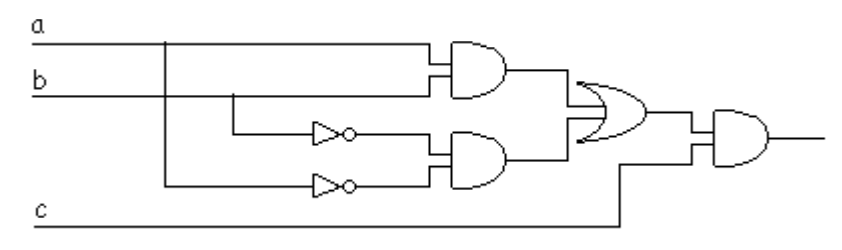

# Universidad Católica del Uruguay

## Facultad de Ingeniería y Tecnologías

### Programación II

 

# Compuertas Lógicas

## 🤯 Problema

Tu mejor amigo esta cursando la carrera de Ingeniería en Electrónica en la UCU,
como sabe que tu haces Informática, pide tu ayuda para que desarrolles un
programa que le permita de manera rápida, evaluar el resultado de un circuito
basado compuertas lógicas.

Para apoyarte en la solución del problema, tu amigo te comparte el siguiente
[repositorio](https://github.com/ucudal/PII_PythonToCSharp_Compuertas) donde
tiene una implementación en Python 🐍 de parte del problema.

## Consideraciones

* Para este problema tu amigo te pide que modeles las tres compuertas lógicas
  básicas: And, Or, Not.

* Recuerda que hay compuertas que deben tener al menos dos entradas para poder
  funcionar, pero otras necesitan solo una entrada.

* Ten en cuenta que las compuertas pueden ser conectables unas con otras, es
  decir, como entrada, cada compuerta puede tener o bien el resultado de la
  evaluación parcial del circuito que la precede o un valor lógico.

## 🏋️‍♀️ Desafío

### Parte 1: Diseño

Construye el diagrama de clases de la solución en UML. Puedes usar cualquier
editor de diagramas, te hacemos dos sugerencias de complementos en Rider para
ello: [Draw.io](https://plugins.jetbrains.com/plugin/15635-diagrams-net-integration)
o [Mermaid](https://plugins.jetbrains.com/plugin/20146-mermaid).

Draw.io es una herramienta [en línea](https://app.diagrams.net/) para crear varios tipos de diagramas,
incluyendo diagramas UML. El complemento nos permite editar los diagramas sin
abandonar el editor de código.

Mermaid es un [lenguaje](https://mermaid.js.org/) inspirado en Markdown con el que escribes un
archivo de texto plano que se renderiza en forma gráfica. El complemento permite
visualizar el texto plano en forma gráfica.

### Parte 2: Implementación

Crea la estructura de proyecto —C#— que corresponda. Recuerda que tienes los
comandos que debes usar para esto explicados
[aquí](https://github.com/ucudal/PII_Comandos/blob/master/Crear_Proyecto_C%23.md).

Luego desarrolla el programa utilizando los conceptos que hemos visto hasta el
momento, incluyendo las guías
[Expert](https://github.com/ucudal/PII_Guias/blob/main/Expert.md),
[Polymorphism](https://github.com/ucudal/PII_Guias/blob/main/Polymorphism.md),
[SRP](https://github.com/ucudal/PII_Guias/blob/main/SRP.md) y
[LSP](https://github.com/ucudal/PII_Guias/blob/main/LSP.md).

### Parte 3: Validación

Escribe los casos de prueba para las compuertas implementadas, puedes y debes
apoyarte en las tablas de verdad para cada una de las compuertas lógicas.

### Parte 4: El Garage

Tu amigo luego de un tiempo vuelve a pedirte ayuda, en esta ocasión para
utilizar tu programa en la resolución de un ejercicio un poco mas complejo, el
ejercicio dice así...

Imagina que tienes que diseñar una puerta electrónica para un garaje, de forma
que solo debe abrirse cuando se pulse una determinada combinación de botones
—A, B y C—, según las condiciones indicadas. Diseña el circuito lógico que
permita la apertura de la puerta del garaje, empleando las puertas lógicas que
consideres oportuno.

Condiciones de apertura:

* C pulsado, A y B en reposo.
* A, B y C pulsados.

Para comenzar a darle solución al problema tu amigo realizó el diseño del
circuito y su tabla de verdad.

Para poder ayudarlo tu deberás:

* Implementar una clase GarageGate utilizando las abstracciones antes definidas.
* Realizar los casos de prueba que validen el correcto funcionamiento de la puerta.

**☘️ ¡Mucha suerte!**
